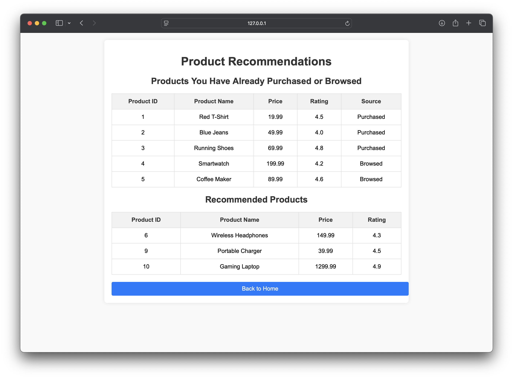
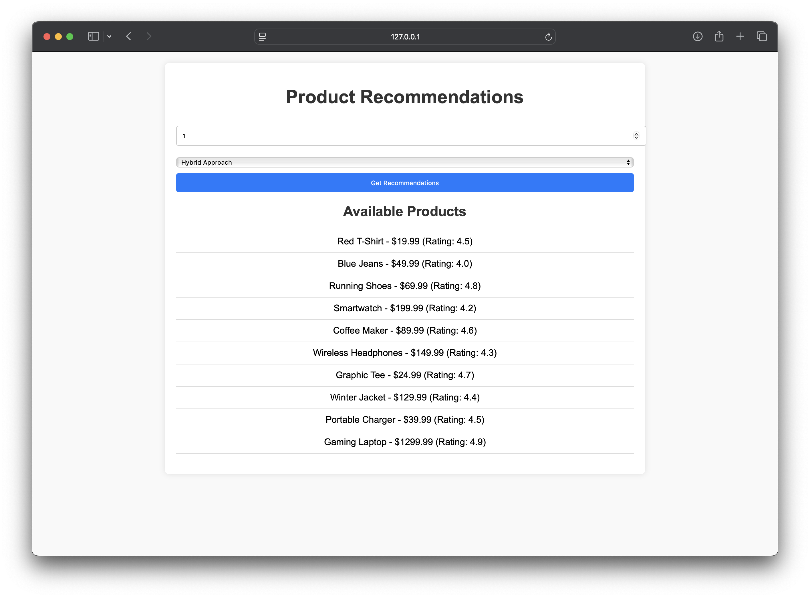

# E-commerce Product Recommendation System

## Project Overview
This project implements a product recommendation system for an e-commerce platform. The system utilizes collaborative filtering and content-based filtering techniques to provide personalized product recommendations to users based on their purchase history.

## Features
- **Collaborative Filtering**: Recommends products based on the purchase behavior of similar users.
- **Content-Based Filtering**: Recommends products based on the attributes of the products the user has previously purchased.
- **Hybrid Approach**: Recommends products by combining Collaborative and Content-Based Filtering.
- **User-Friendly Interface**: A web application built with Flask for easy interaction and recommendations.

## Technologies Used
- **Python**: For backend logic and data processing.
- **Flask**: Web framework for creating the web application.
- **Pandas**: For data manipulation and analysis.
- **HTML/CSS**: For frontend design.

## Getting Started

### Prerequisites
- Python 3.x
- Flask
- Pandas

### Installation
1. Clone the repository:
   ```bash
   git clone <repository-url>
   ```

2. Navigate to the project directory:
   ```bash
   cd er
   ```

3. Install the required packages:
   ```python
   pip install flask pandas
   ```

## Running The Application
1. Start the Flask server:
   ```python
   python app.py

   ```
2. Open your web browser and navigate to http://127.0.0.1:5000.


## Data Files
1. `users.csv`: Contains user information.
2. `products.csv`: Contains product details such as name, category, description, price, and rating.
3. `purchases.csv`: Contains user purchase history.
4. `browsing_history`: Contains user browsing history.

## Usage
1. Enter a user ID and select a recommendation method (collaborative, content-based or hybrid approach).
2. Click on "Get Recommendations" to view the recommended products. 

## Screenshots




## Contributing
If you would like to contribute to this project, please fork the repository and submit a pull request.

## Future Enhancements

- **More Data**: I plan to add more file to enhance the collaborative filtering aspect of our recommendation system.
  
- **Clean UI**: Improving the user interface (UI) for your e-commerce product recommendation system can significantly enhance user experience and engagement.

- **Feedback Mechanism**: Implement a way for users to provide feedback on the recommendations, which can help refine the system.

- **Explainability**: Work on explaining the reasoning behind recommendations, which can enhance user trust and satisfaction.


   
